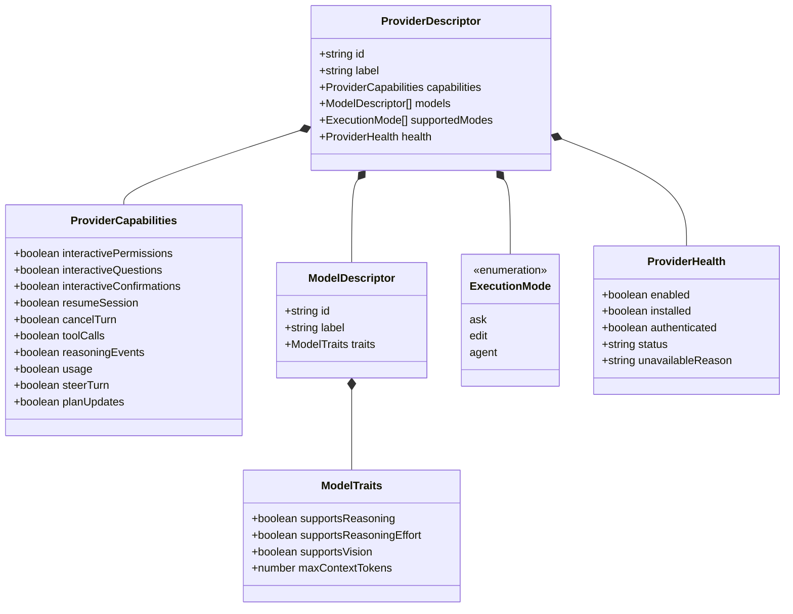

# Area: Provider capability model

## Purpose

Deconstruct the current unstructured boolean capabilities map (`AgentCapabilities`) into clean, distinct architectural domains: Provider Transport Capabilities, Model Inference Traits, Execution Modes, and Runtime Availability.

---

## 1. Domain responsibility separation

### Current fact
- `AgentCapabilities` in `tools/dashboard/server/ai/contracts.mjs` defines a flat list of 10 booleans:
  `interactivePermissions`, `interactiveQuestions`, `interactiveConfirmations`, `resumeSession`, `cancelTurn`, `toolCalls`, `reasoning`, `usage`, `steerTurn`, `planUpdates`.
- This mixes transport/protocol abilities of the adapter with intrinsic inference properties of AI model weights.
- Moving `reasoning` exclusively to the model level breaks transport checks (if an adapter cannot stream reasoning events from the CLI, model support alone is insufficient).
- Duplicating flags like `toolCalls` (provider) and `toolCalling` (model) creates overlapping, undefined semantics.

### Proposed target
Establish explicit responsibility boundaries between transport capabilities and model traits:

### Owner decision required
*Status: Awaiting owner approval on [owner-decisions.md](owner-decisions.md) § Decision 4.*

---

## 2. Transport capabilities vs model traits

### Current fact
- Adapters currently declare capabilities monolithically. For example, Claude declares `reasoning: true` even though earlier Claude 3.5 models do not emit thinking blocks.

### Proposed target
1. **Transport / Integration Capabilities (`ProviderCapabilities`)**:
   - Inherent to the adapter transport and CLI integration protocol.
   - `interactiveQuestions`: Transport can conduct mid-turn question interactions.
   - `interactivePermissions`: Transport can conduct mid-turn tool permission interactions.
   - `interactiveConfirmations`: Transport can conduct mid-turn confirmation interactions.
   - `resumeSession`: Transport supports multi-turn session continuation across process exits.
   - `cancelTurn`: Transport supports graceful in-flight cancellation.
   - `toolCalls`: Transport can parse and stream structured tool invocations. (Sole authoritative flag for tool calling; no duplicate on model).
   - `reasoningEvents`: Transport can capture and stream `reasoning.delta` events from the CLI/daemon stream.
   - `usage`: Transport reports token consumption and cost telemetry.
   - `steerTurn`: Transport supports mid-turn prompt redirection.
   - `planUpdates`: Transport emits structured plan or task progress.

2. **Model Traits (`ModelTraits`)**:
   - Intrinsic to specific AI model weights and training.
   - `supportsReasoning`: Model produces chain-of-thought tokens.
   - `supportsReasoningEffort`: Model accepts `low`, `medium`, or `high` reasoning effort configuration (e.g. Claude 3.7 Sonnet, Gemini 2.0 Flash Thinking, o3).
   - `supportsVision`: Model accepts multimodal image attachments.
   - `maxContextTokens`: Maximum context window size.

3. **Effective Turn Behavior**:
   - The runtime derives the effective capabilities of a turn from the intersection:
     - Reasoning stream is active only when `capabilities.reasoningEvents === true` **AND** `model.traits.supportsReasoning === true`.
     - Reasoning effort controls are shown only when `model.traits.supportsReasoningEffort === true`.

### Owner decision required
*Status: Awaiting owner approval on [owner-decisions.md](owner-decisions.md) § Decision 4.*

---

## 3. Execution mode policy (`ExecutionMode`)

### Current fact
- `AGENT_EXECUTION_MODES` in `contracts.mjs` defines `['ask', 'edit', 'agent']` with default `'edit'`.
- Execution mode is not a provider capability; it is an operator security policy passed to the provider to configure sandbox restrictions and approval boundaries:
  - `ask` (Read-only): Sandboxed, no file writes or mutating commands. (Codex: `sandbox: 'read-only'`; Claude: `--permission-mode plan`; Antigravity: `--mode=plan`).
  - `edit` (Workspace write with safeguards): Modifies repository workspace files. (Codex: `sandbox: 'workspace-write'`; Claude: `--permission-mode acceptEdits`; Antigravity: `--mode=accept-edits`).
  - `agent` (Autonomous with escalation): Full workspace access with command execution. (Codex: `on-request` approval; Claude: `--permission-mode bypassPermissions`; Antigravity: `--mode=accept-edits --dangerously-skip-permissions`).

### Proposed target
- Maintain `ExecutionMode` as a first-class policy orthogonal to provider capabilities and model traits.
- The provider descriptor declares `supportedModes: AgentExecutionMode[]` indicating which modes the adapter currently maps.
