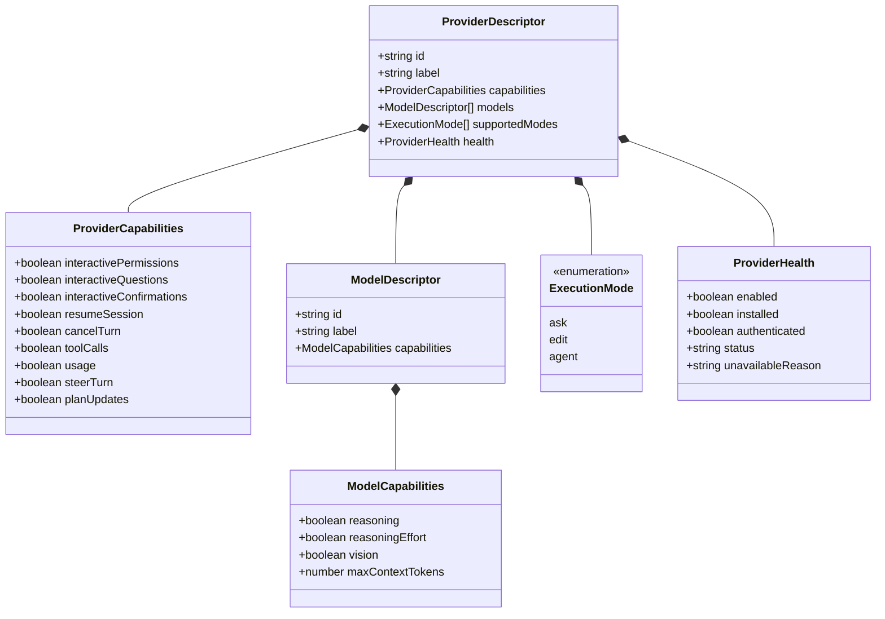

# Area: Provider capability model

## Purpose

Deconstruct the current unstructured boolean capabilities map (`AgentCapabilities`) into clean, distinct architectural responsibility domains: Provider Capabilities, Model Capabilities, Execution Modes, and Runtime Availability.

---

## Responsibility domain separation

Currently, `AgentCapabilities` groups 10 disparate concerns into a flat boolean map on the provider descriptor. This conflates transport protocol constraints, model inference traits, security boundaries, and runtime health.

The hardened architecture establishes four explicit responsibility boundaries:

---

## 1. Provider-level capabilities (`ProviderCapabilities`)
These represent transport, protocol, and integration invariants inherent to how Nevo connects to the provider. They do NOT vary by model:

- `interactiveQuestions`: Provider transport supports mid-turn interactive questions (Codex via JSON-RPC, Claude via MCP).
- `interactivePermissions`: Provider transport supports mid-turn interactive permission requests (Codex via JSON-RPC).
- `interactiveConfirmations`: Provider transport supports mid-turn confirmation interactions.
- `resumeSession`: Provider supports resuming a persistent conversation across turn boundaries (`--resume`, `--conversation`, `thread/resume`).
- `cancelTurn`: Provider supports gracefully cancelling an active turn (`cancelTurn()`).
- `toolCalls`: Provider emits structured tool invocations (`mapClaudeTool`, `mapCodexCommandActions`, `mapAntigravityTool`).
- `usage`: Provider reports token telemetry (`tokensIn`, `tokensOut`, `cost`).
- `steerTurn`: Provider supports mid-turn user steering injections without full cancellation.
- `planUpdates`: Provider emits structured architectural plan or task updates.

---

## 2. Model-level capabilities (`ModelCapabilities`)
These represent inference traits determined by the specific AI model weights and training, not the CLI wrapper:

- `reasoning`: Model supports extended chain-of-thought or thinking blocks (e.g. Claude 3.7 Sonnet, o3, Gemini 2.0 Flash Thinking).
- `reasoningEffort`: Model accepts explicit reasoning effort controls (`low`, `medium`, `high`).
- `vision`: Model accepts multimodal image attachments.
- `maxContextTokens`: Maximum context window size supported by the model architecture.

---

## 3. Execution mode policy (`ExecutionMode`)
Execution mode is NOT a provider capability. It is an **operator intent** and **security policy** passed to the provider to configure sandbox restrictions and approval boundaries:

- `ask` (Read-only): Non-mutating analysis. Sandboxed execution with write access disabled; no approval prompts required. (Codex: `approvalPolicy: 'never'`, `sandbox: 'read-only'`; Claude: `--permission-mode plan`; Antigravity: `--mode=plan`).
- `edit` (Workspace write with safeguards): Modifies repository workspace files with interactive or confirmation safeguards. (Codex: `approvalPolicy: 'on-request'`, `sandbox: 'workspace-write'`; Claude: `--permission-mode acceptEdits`; Antigravity: `--mode=accept-edits`).
- `agent` (Autonomous with escalation): Full autonomous repository work with workspace access and explicit escalation for out-of-sandbox operations. (Codex: `on-request` approval with unrestricted roots; Claude: `--permission-mode bypassPermissions`; Antigravity: `--mode=accept-edits --dangerously-skip-permissions`).

---

## 4. Runtime availability and health (`ProviderHealth`)
Runtime status must never be reported as a capability:
- A provider that is rate-limited does not lose `toolCalls: true`; it is temporarily `degraded`.
- A provider missing an API key does not lose `interactiveQuestions: true`; it is `unauthenticated`.
- A provider whose binary is missing from PATH is `installed: false`.

Separating these four domains ensures that downstream components (composer UI, retry loops, security guards) query the exact domain responsible for the decision.
